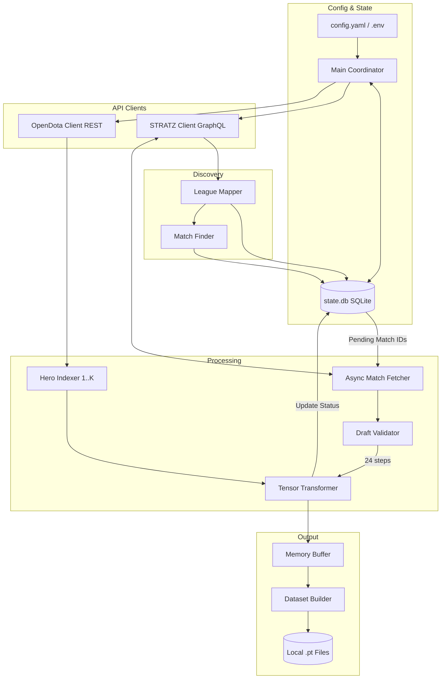

```mermaid
flowchart TD
    subgraph Config & State
        Config[config.yaml / .env] --> Main[Main Coordinator]
        Main <--> DB[(state.db SQLite)]
    end

    subgraph API Clients
        Main --> SC[STRATZ Client GraphQL]
        Main --> OC[OpenDota Client REST]
    end

    subgraph Discovery
        SC --> LM[League Mapper]
        LM --> DB
        LM --> MF[Match Finder]
        MF --> DB
    end

    subgraph Processing
        OC --> HI[Hero Indexer 1..K]
        DB -- Pending Match IDs --> Fetcher[Async Match Fetcher]
        SC <--> Fetcher
        Fetcher --> Validator[Draft Validator]
        Validator -- 24 steps --> Transformer[Tensor Transformer]
        HI --> Transformer
    end

    subgraph Output
        Transformer --> Buffer[Memory Buffer]
        Buffer --> PT[Dataset Builder]
        PT --> Disk[(Local .pt Files)]
        Transformer -- Update Status --> DB
    end
```