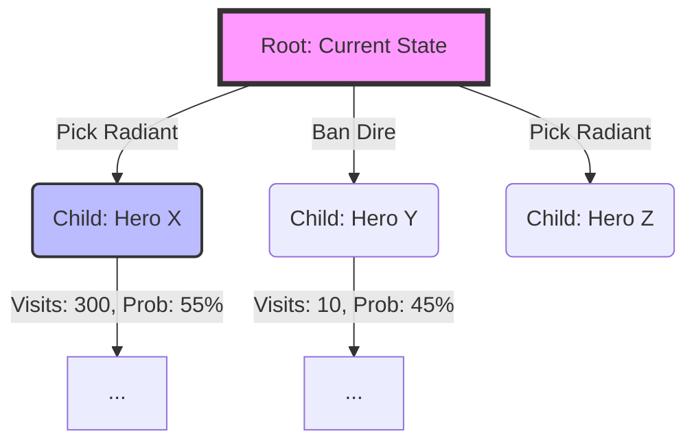

# MCTS Tree Graph Layout

*Note: This task is purely backend algorithmic optimization. This diagram illustrates the memory structure of the MCTS tree being reused across turns, rather than a UI layout.*