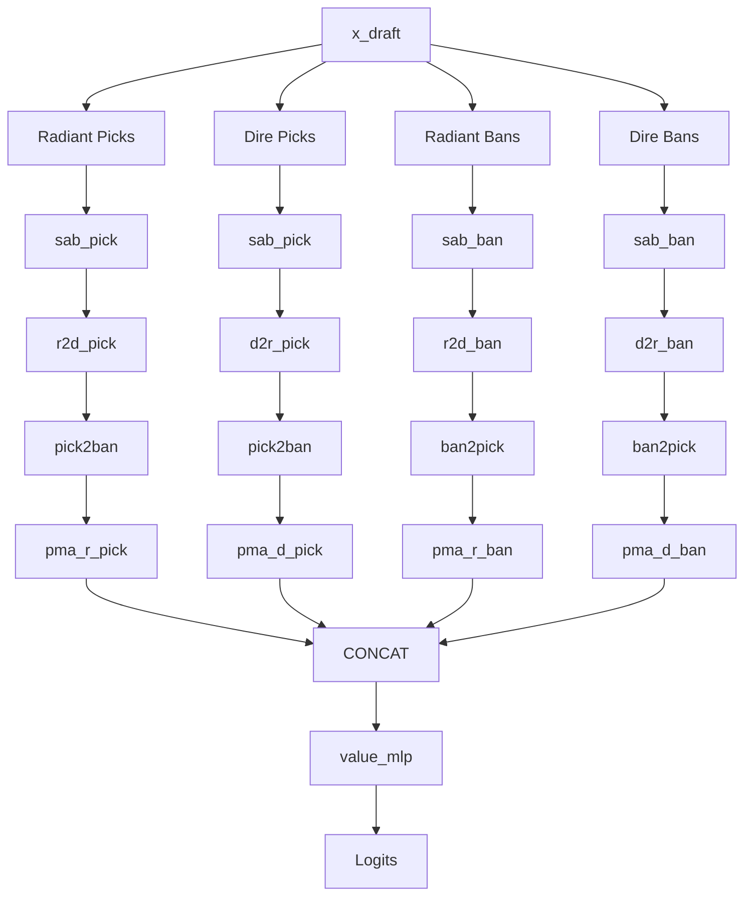

```mermaid
graph TD
    X[x_draft] --> M_RP[Radiant Picks]
    X --> M_DP[Dire Picks]
    X --> M_RB[Radiant Bans]
    X --> M_DB[Dire Bans]
    
    M_RP --> SAB_P1[sab_pick]
    M_DP --> SAB_P2[sab_pick]
    M_RB --> SAB_B1[sab_ban]
    M_DB --> SAB_B2[sab_ban]
    
    SAB_P1 --> R2D_P[r2d_pick]
    SAB_P2 --> D2R_P[d2r_pick]
    SAB_B1 --> R2D_B[r2d_ban]
    SAB_B2 --> D2R_B[d2r_ban]
    
    R2D_P --> P2B1[pick2ban]
    D2R_P --> P2B2[pick2ban]
    R2D_B --> B2P1[ban2pick]
    D2R_B --> B2P2[ban2pick]
    
    P2B1 --> PMA_RP[pma_r_pick]
    P2B2 --> PMA_DP[pma_d_pick]
    B2P1 --> PMA_RB[pma_r_ban]
    B2P2 --> PMA_DB[pma_d_ban]
    
    PMA_RP --> CONCAT
    PMA_DP --> CONCAT
    PMA_RB --> CONCAT
    PMA_DB --> CONCAT
    
    CONCAT --> MLP[value_mlp]
    MLP --> Logits
```