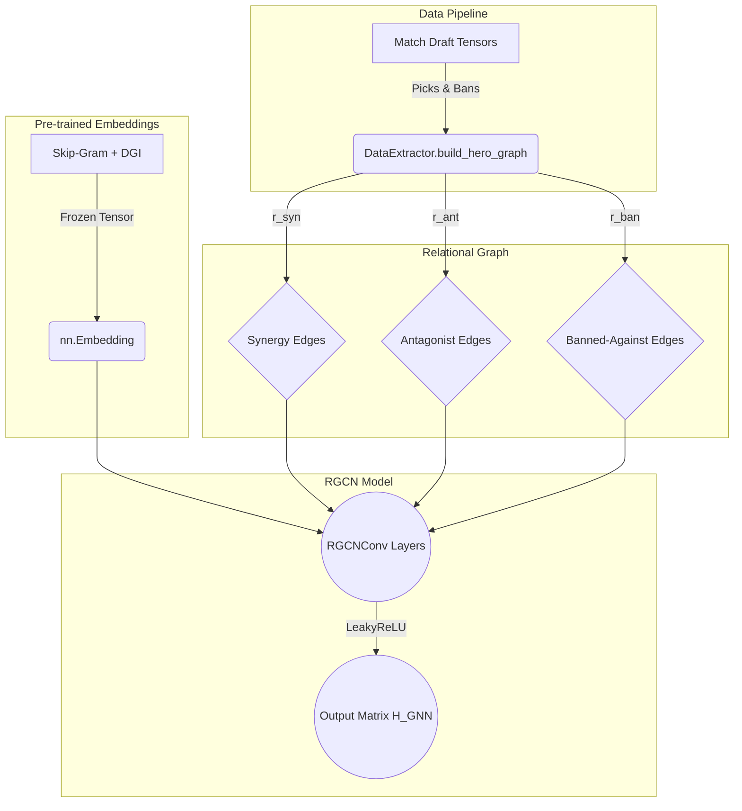

# RGCN Relational Graph Layout

```mermaid
graph TD
    subgraph Data Pipeline
        A[Match Draft Tensors] -->|Picks & Bans| B(DataExtractor.build_hero_graph)
    end
    
    subgraph Relational Graph
        B -->|r_syn| C{Synergy Edges}
        B -->|r_ant| D{Antagonist Edges}
        B -->|r_ban| E{Banned-Against Edges}
    end

    subgraph Pre-trained Embeddings
        F[Skip-Gram + DGI] -->|Frozen Tensor| G(nn.Embedding)
    end

    subgraph RGCN Model
        G --> H((RGCNConv Layers))
        C --> H
        D --> H
        E --> H
        H -->|LeakyReLU| I((Output Matrix H_GNN))
    end
```