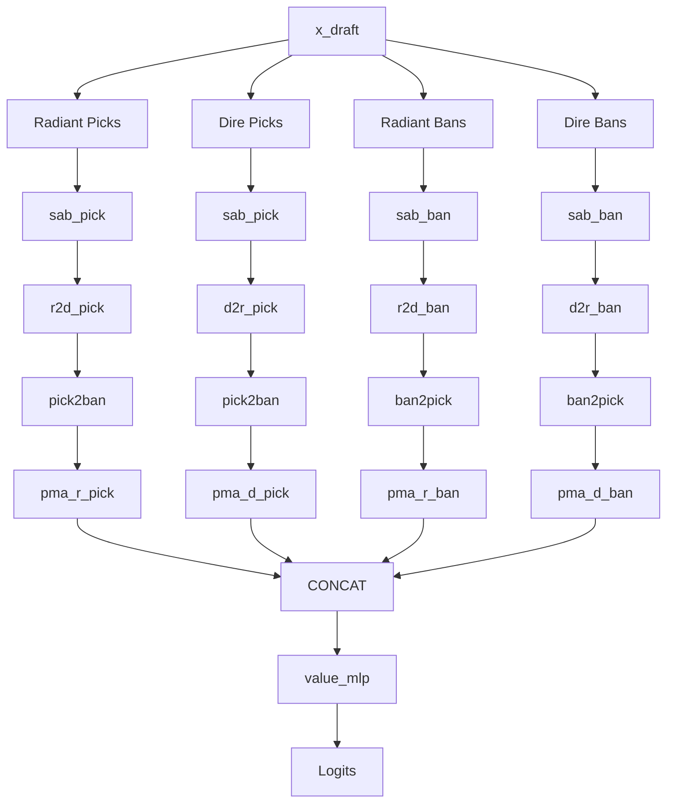

# Technical Specification: Set Transformer Upgrade (AUT-38)

## 1. Overview
This specification details the architectural changes required to upgrade the `SetTransformerHead` to a dual-channel structure supporting both pick and ban inputs. The upgrade allows the value head to derive partial estimations from the bans of both teams, maintaining permutation invariance and extending cross-attention between pick and ban sets. Additionally, the Brier calibration score will be integrated into the value head's metrics.

## 2. Structural Changes

### 2.1. `SetTransformerHead` Enhancements
The `SetTransformerHead` in `src/dota2drafter/models/match_network.py` will be modified to support 4 sets of embeddings extracted from the draft sequence: Radiant Picks, Dire Picks, Radiant Bans, and Dire Bans.

**New Components in `__init__`:**
* **Self-Attention Blocks (SABs):** `sab_pick` and `sab_ban` (replaces `sab`).
* **Cross-Team Attention:** `r2d_pick`, `d2r_pick`, `r2d_ban`, `d2r_ban` (replaces `r2d_attn`, `d2r_attn`).
* **Cross-Channel Attention:** `pick2ban` and `ban2pick` to allow picks to attend to bans and vice-versa.
* **PMA Poolers:** `pma_r_pick`, `pma_d_pick`, `pma_r_ban`, `pma_d_ban`.
* **Seeds:** `seed_r_pick`, `seed_d_pick`, `seed_r_ban`, `seed_d_ban`.
* **Value MLP:** The input dimension expands from `2 * d_model` to `4 * d_model` to accommodate the four pooled embeddings.

### 2.2. Tensor Masking and Set Extraction
A new helper method `_extract_set(mask, embeddings, max_items)` will be introduced to cleanly extract dynamically sized sets into padded tensors (`max_picks=5`, `max_bans=7`). 

The draft tensor masks will correctly differentiate picks from bans:
* `action_mask = x_draft[:, :, 0] == 1.0` (Picks)
* `ban_mask = (x_draft[:, :, 0] == 0.0) & (x_draft[:, :, 2] >= 0.0)` (Bans)
* `team_mask = x_draft[:, :, 1] == 0.0` (Radiant=0, Dire=1)

**Edge Cases & Disambiguation:**
* **Mask Disambiguation:** Verify that `x_draft[:, :, 2] >= 0.0` correctly filters unpadded hero tokens vs. zero-padded background slots in intermediate batch tensors.

### 2.3. Cross-Attention Flow
1. **Self-Attention:** `rp_syn = sab_pick(rp, rp, rp)`, `rb_syn = sab_ban(rb, rb, rb)`, etc.
2. **Cross-Team Attention:** `rp_cross = r2d_pick(rp_syn, dp_syn, dp_syn)`, `rb_cross = r2d_ban(rb_syn, db_syn, db_syn)`, etc.
3. **Cross-Channel Attention:** Picks will query a concatenated key/value tensor of all bans (`[rb_cross, db_cross]`), and Bans will query all picks (`[rp_cross, dp_cross]`).
   * `rp_out = pick2ban(rp_cross, all_bans, all_bans)`
   * `rb_out = ban2pick(rb_cross, all_picks, all_picks)`
4. **Pooling & MLP:** Seed poolers reduce all 4 channels to `(batch_size, d_model)` which are concatenated and passed through `value_mlp`.

**Edge Cases for Attention Blocks:**
* **Empty Set Padding / Attention Masks:** At draft Step 0, both teams have zero picks and zero bans. Ensure `_extract_set` and the cross-attention blocks (`pick2ban`, `ban2pick`) apply dynamic key-padding masks or return zero-tensors when querying empty sets to prevent `NaN` losses or division-by-zero during softmax normalization.

### 2.4. Value Head Embedding Input
* Ensure the embeddings used as input to the `SetTransformerHead` are the ones **after** the film patch embedding, not the hero pure embedding.

### 2.5. Brier Calibration Score Metric
The Brier score measures the mean squared error between predicted probabilities and actual binary labels.
* Update `compute_metrics` in `src/dota2drafter/training/transformer_trainer.py` to calculate:
  ```python
  probs = torch.sigmoid(predictions)
  brier_score = torch.nn.functional.mse_loss(probs, targets).item()
  ```
* Include `"brier_score"` in the returned dictionary.
* Update `TrainingMetrics` dataclass to track `val_brier_scores`.
* Append `val_metrics["brier_score"]` to `self.metrics.val_brier_scores` in `transformer_trainer.py` `train()` loop.

## 3. Data Flow Diagram



## 4. Implementation Steps
1. Modify `TrainingMetrics` and `compute_metrics` in `transformer_trainer.py` to calculate and track the Brier score.
2. Update the `SetTransformerHead` class in `match_network.py` by redefining the initialization modules for the expanded dual-channel structure.
3. Add the `_extract_set` helper method to `SetTransformerHead`, ensuring robust handling of empty sets at Step 0.
4. Rewrite the `forward()` method of `SetTransformerHead` to extract 4 sets, process them through the expanded attention flow (using embeddings with film patch applied), and concatenate them for the MLP.
5. Update `scripts/` or `tests/` if any tensor sizes implicitly assumed `2 * d_model` instead of the internal `SetTransformerHead` handling. (Internal changes should abstract this, but tests should be run).